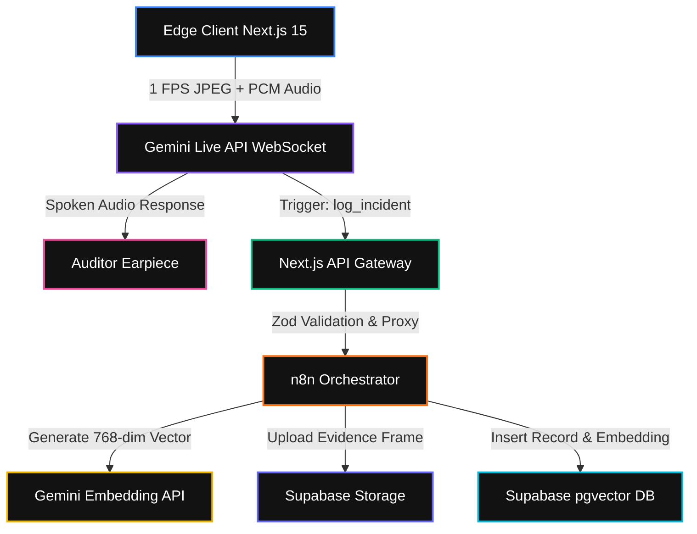

# 🛡️ Audit Air AI
### Real-Time Multimodal Compliance & Safety Auditing Platform

[](https://nextjs.org/)
[](https://ai.google.dev/)
[](https://supabase.com/)
[](https://n8n.io/)
[](https://www.vultr.com/)

---

## 🚀 Overview

**Audit Air AI** is a production-grade, real-time safety compliance watchdog designed for high-risk industrial environments (construction, manufacturing, and logistics). Moving beyond static photo uploads and manual inspections, Audit Air utilizes **Gemini's bidirectional Live WebSocket API** to stream live video and audio from the field. It provides instant, hands-free spoken warnings to auditors while automatically orchestrating incident logs, frame storage, and vector embeddings through a self-hosted backend.

---
## 🏗️ System Architecture & Workflow



---

## 🛠️ Tech Stack

* **Frontend:** Next.js 15 (App Router), React, TailwindCSS, WebRTC/Canvas API, Web Audio API.
* **AI Engine:** Gemini Live API (Bidi-streaming WebSockets) & Gemini `text-embedding-004`.
* **Backend Orchestration:** Self-hosted n8n (Dockerized).
* **Database & Storage:** Supabase (PostgreSQL + `pgvector` + Object Storage).
* **Infrastructure:** Vultr Cloud Compute (Docker Compose + Caddy SSL Reverse Proxy).

---

## ✨ Key Features

* **Sub-Second Voice Interventions:** Streams real-time audio and video chunks over bi-directional WebSockets for immediate verbal hazard warnings.
* **Token-Optimized Edge Throttling:** Implements an invisible HTML `<canvas>` loop capturing exact frames at **1 FPS** (`quality: 0.5`), radically reducing network and token overhead.
* **Vector-Powered Semantic RAG:** Generates embeddings for every safety incident, allowing deep K-Nearest Neighbors (KNN) cosine similarity searches against past violations.
* **Industrial Control Room HUD:** A high-contrast, dark-mode operational dashboard featuring live telemetry, recording timers, and a real-time incident ticker.
* **Rigorous Schema Validation:** Strict runtime boundary checks using Zod on API routes to block malformed payloads before they hit the orchestrator.

---

## 📂 Project Structure

```text
audit-air-ai/
├── app/
│   ├── api/
│   │   ├── ingest/route.ts      # Webhook ingestion & validation proxy
│   │   └── search/route.ts      # Semantic vector search endpoint
│   └── workspace/
│       └── [sessionId]/page.tsx # Industrial control room dashboard HUD
├── components/                  # UI components & visualizers
├── hooks/
│   └── useAuditStream.ts        # Hardware capture & 1-FPS canvas hook
├── lib/
│   └── LiveAgentClient.ts       # Gemini Live WebSocket client & audio decoder
├── docker-compose.yml           # Vultr multi-container infrastructure
├── schema.sql                   # Supabase pgvector DDL & RLS policies
└── README.md

🚀 Quick Start & Deployment
1. Environment Configuration
Create a .env file in your root directory:
NEXT_PUBLIC_GEMINI_API_KEY="your-google-ai-studio-api-key"
NEXT_PUBLIC_SUPABASE_URL="[https://your-project.supabase.co](https://your-project.supabase.co)"
SUPABASE_SERVICE_ROLE_KEY="your-supabase-service-role-key"
N8N_WEBHOOK_URL="[https://your-n8n-domain.com/webhook/audit-incident](https://your-n8n-domain.com/webhook/audit-incident)"

2. Database Initialization
Run the following DDL in your Supabase SQL Editor to enable vector indexing and storage:
create extension if not exists vector;

create table if not exists public.incidents (
  id uuid primary key default gen_random_uuid(),
  created_at timestamp with time zone default timezone('utc'::text, now()) not null,
  hazard_type text not null,
  description text not null,
  severity text check (severity in ('low', 'medium', 'high', 'critical')) not null,
  image_path text not null,
  image_url text not null,
  embedding vector(768)
);

create index if not exists incidents_embedding_idx 
on public.incidents using ivfflat (embedding vector_cosine_ops) 
with (lists = 100);

3. Deploy Infrastructure via Docker
Spin up the stack on your Vultr cloud instance:
docker compose up -d --build

📄 License
Distributed under the MIT License. See LICENSE for more information.
